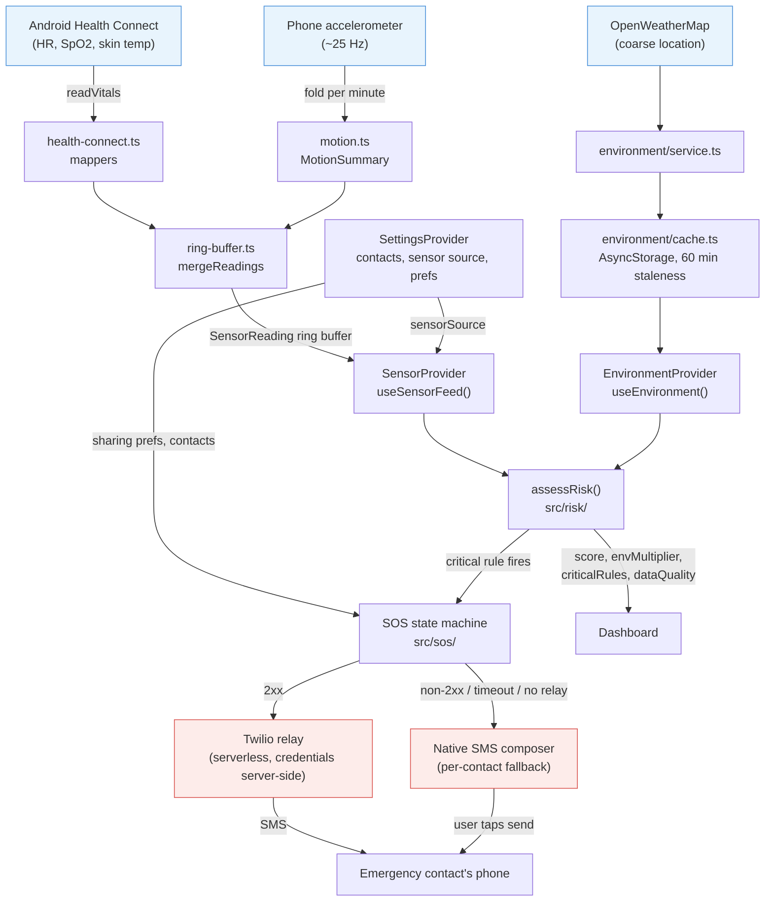

# Architecture overview

## Status
Built · Unit tested · Integration tested — not device validated, not real-world validated (see
[`docs/PROJECT_STATUS.md`](../PROJECT_STATUS.md)).

## Data flow

Health Connect (heart rate, SpO₂, skin temperature) and the phone's own accelerometer are the two
sensor inputs. Each is mapped into the single unified `SensorReading` schema by an adapter, merged
into a ring buffer, and only then handed to the pure rule engine together with the latest
environment snapshot. The engine never sees a native Health Connect or accelerometer type directly.

## The three providers

- **`SettingsProvider`** — the single source of truth for contacts, display name, sharing
  preferences, and the sensor-source picker (`simulated` / `health_connect` / `ble_esp32`).
  Persists to AsyncStorage (`src/settings/store.ts`).
- **`EnvironmentProvider`** — one weather/AQI snapshot per app instance, refreshed every 30 minutes
  plus a foreground catch-up, cache-first with a `status: 'cached'` badge and a 60-minute staleness
  bound. Never prompts from the background.
- **`SensorProvider`** — mounted inside `SettingsProvider`, enabled only when
  `sensorSource === 'health_connect'`. Owns the Health Connect polling loop (60 s cadence,
  full-retention-window reads to catch batch-synced late records) and the accelerometer fold; throws
  if `useSensorFeed()` is called outside the provider.

Each provider is a single source of truth for its feed, so two screens can never disagree about the
current reading, the current weather, or the current settings.

## What leaves the device

- **OpenWeatherMap requests** — coarse (city-level) location only, to fetch weather and air-pollution
  data for the heat and AQI display. This is the only outbound traffic that runs continuously.
- **SOS SMS** — either via the Twilio relay (one POST per contact, with the composed message and a
  precise GPS fix taken only at SOS time) or via the native SMS composer, which the OS — not this
  app — transmits once the user presses send.

No raw vital ever leaves the device. There is no backend that stores or receives HR, SpO₂, skin
temperature, or motion data.

## What is stored on the device

Two AsyncStorage keys, both plaintext (not encrypted — see
[`docs/security/privacy-architecture.md`](../security/privacy-architecture.md)):

- `phc.settings.v1` (`src/settings/store.ts`) — emergency contacts (E.164 normalised), display name,
  sharing preferences, sensor source.
- The environment cache key (`src/environment/cache.ts`) — the last-known-good weather/AQI snapshot,
  for offline/stale-network display.

No sensor reading is persisted anywhere today. The `SensorReading` ring buffer lives only in React
state; killing the app discards it. This is why the Trends screen cannot show real history yet (see
`docs/PROJECT_STATUS.md` → Mock/Demo).
